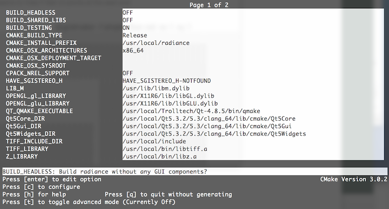

#Exporting STADIC utilities

####Rob Guglielmetti - September 4, 2015
*rev.2015.09.05 RPG*

This HOWTO illustrates the steps for using [Jason DeGraw](https://github.com/jasondegraw)'s [export script](https://github.com/Architectural-Lighting-Simulation/STADIC/blob/export-script/export.py) to take a [STADIC](https://github.com/Architectural-Lighting-Simulation/STADIC) utility and export it for inclusion in [Radiance](https://github.com/NREL/Radiance/tree/combined) source, as well as building and testing. The DXGridmaker utility is used as an example here, **and is what the export script exports at the present time (September, 4 2015)**.

**NOTE:** The point of this script is to facilitiate the migration of some (or all) of the STADIC tools into the Radiance source code. That export process will be a one-time dealio for each tool migrated, ultimately making this export script pointless. But the processes for exporting, building, and testing (plotting) are reusable, hence this HOWTO. In other words, it's all about me. 

##Export

**Got STADIC?**
``` csh
$ mkdir [path_to_your_repos]/stadic
$ cd [path_to_your_repos]/stadic
$ git clone https://github.com/Architectural-Lighting-Simulation/STADIC.git .
```
Get on the right branch:
``` csh
$ git checkout export-script
```

**Run the export script**
``` csh
$ python ./export.py --boost-prefix src/stadic/
```

The script will export the DXGridmaker code and a minimal export of the required Boost libraries to a top-level dir called "stadic-export". This directory and its contents are ready to be folded in with the ```src``` directory of the Radiance repo. To that end:

**Got Radiance?**
``` csh
$ mkdir [path_to_your_repos]/radiance
$ cd [path_to_your_repos]/radiance
$ git clone https://github.com/NREL/Radiance.git .
$ git checkout combined
```
ASSuming your **Radiance** and **STADIC** repos are at the same level, then **from the ```stadic``` directory** (where you just ran the export script from), issue:
``` csh
$ cp -R ../stadic-export/ ../radiance/src/stadic
```
##Build

**Go to your Radiance build directory, configure CMake, and build Radiance**
``` csh
$ cd ../radiance/src/
$ cd [your_build_dir]
$ ccmake .
```
Some suggested CMake config options:

``` csh
$ make
```

##Test
Let's use a simple input file called ```simple_floor.rad``` for testing:
``` csh
$ [path_to]/dxgridmaker -f simple_floor.rad [options] > test.pts
```

DXgridmaker includes diagnostic plotting options (see ```-v*``` options).

The following Rscript snippet will make a simple 2D spatial plot of the x,y output:
``` R
library(ggplot2)
points <- read.csv(file = "./simple.pts", sep = " ", header = FALSE )
points <- points[c(1,2)]
qplot(
  V1, V2, data=points, 
  xlim = c(0,50), 
  ylim = c(-10,40),
  main = "dxgridmaker [options]",
  xlab = "x units",
  ylab = "y units",
  )
```
Here are a few R plots of DXgridmaker output:

Case One here seems to miss 5 feet of points at the east end:


Case two has the same issue, even with different x,y spacing:


The ```-o 0``` option seems to work well in Case Three. What's not obvious in this plot (but is present in the file) is the coincident points along the line defined by (20,0 20,20) are duplicated. This is because the two polygons in the input file are still not being joined. This is a known issue.


Another example without ```-o 0```, but with a small x and y offset. The eastern points (x > 40) are written out, but the wall offsets are inconsistent. 


####A simple input file called simple_floor.rad:####
This input was used for the tests and plot parameters in this HOWTO. Just sayin'. 

``` Text
# simple_floor.rad
material polygon simple
0
0 
12
0 0 0
20 0 0
20 20 0
0 20 0

material polygon degenerate
0
0
39
20 0 0
20 -10 0
35 5 0
45 5 0
45 20 0
28 20 0
28 30 0
45 30 0
45 40 0
10 40 0
10 30 0
20 30 0
20 0 0
```


